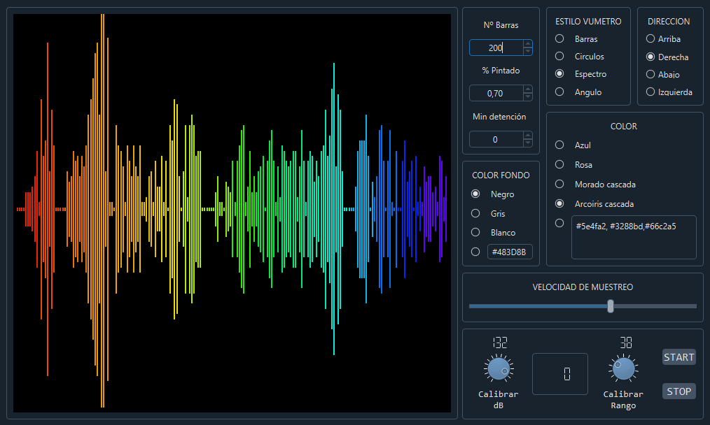

# VuMeterGG

VuMeterGG is a Qt Designer widget developed with PySide6. It captures audio from the microphone and displays it through a graphical representation.
It includes many parameters to customize how the graphical representation of the sound is displayed and to calibrate it.

## Installation
You can use VuMeterGG, directly with PySide6 in your Python project, or you can integrate it into your graphical interface by promoting custom widgets from Qt Designer.

### QT Designer
1. Place the `vu_meter_gg.py` file in your project. In the demo, it is located in `demo/view/qt_ui/promoted/vu_meter_gg.py`.
2. From QT Designer, insert a `QWidget`.
3. Promote the `QWidget` to `VuMeterGG`:
   - Insert `VUMeterGG` in the name field.
   - Use the file path without its extension in the header file field. In the demo, it is `view/qt_ui/promoted/vu_meter_gg`.

### Directly
Create an instance of `VUMeterGG` and place it in your layout.

To configure the vu meter call the methods through the name you gave to the widget or modify the attributes directly from the vu_meter_gg.py file

## Config
To configure the vu meter, call the methods through the name you gave to the widget or modify the attributes directly in the `vu_meter_gg.py` file.

## Documentation
A manual for version v0.1.0-beta is available in Spanish. You can download it [here](docs/manual_v0.1.0-beta_spanish.pdf).

## Requirements
- PyAudio
- PySide6
- PySide6-Addons
- PySide6-Essentials
- shiboken6

## Contributors ✨

Thanks go to these wonderful people ([emoji key](https://allcontributors.org/docs/en/emoji-key)):

<!-- ALL-CONTRIBUTORS-LIST:START - Do not remove or modify this section -->
<!-- prettier-ignore-start -->
<!-- markdownlint-disable -->
<table>
  <tbody>
    <tr>
      <td align="center" valign="top" width="14.28%"><a href="https://github.com/DavidGG-dev"> <b>David García González</b></a> <a href="#maintenance-DavidGG-dev" title="Maintenance">🚧</a> <a href="#code-DavidGG-dev" title="Code">💻</a></td>
    </tr>
  </tbody>
</table>

<!-- markdownlint-restore -->
<!-- prettier-ignore-end -->

<!-- ALL-CONTRIBUTORS-LIST:END -->

This project follows the [all-contributors](https://allcontributors.org) specification.
Contributions of any kind are welcome!

## How to contribute
Contributions are welcome! If you would like to contribute to this project, please follow these steps:

1. Fork the repository.
2. Create a new branch 
3. Make your changes and commit them
4. Push to the branch.
5. Open a pull request.

For major changes, please open an issue first to discuss what you would like to change.

Please make sure to update tests as appropriate.

Thank you for your contributions!

Please read the [CONTRIBUTING.md](CONTRIBUTING.md) file for details on how to contribute to this project.

## Code of Conduct

Please read the [CODE_OF_CONDUCT.md](CODE_OF_CONDUCT.md) file for more details on our code of conduct.

## Third-Party Licenses

- [PyAudio](https://github.com/CristiFati/pyaudio)
- [Qt5](https://github.com/qt/qt5)
- [PySide6](https://github.com/qtproject/pyside-pyside-setup)
- [QDarkStyleSheet](https://github.com/ColinDuquesnoy/QDarkStyleSheet)

For more details, see the [THIRD_PARTY_LICENSES.md](THIRD_PARTY_LICENSES.md) file.

## License

VuMeterGG is distributed under the GNU Lesser General Public License v3.0 only.

For more details, see the [LICENSE.md](LICENSE.md) file.
